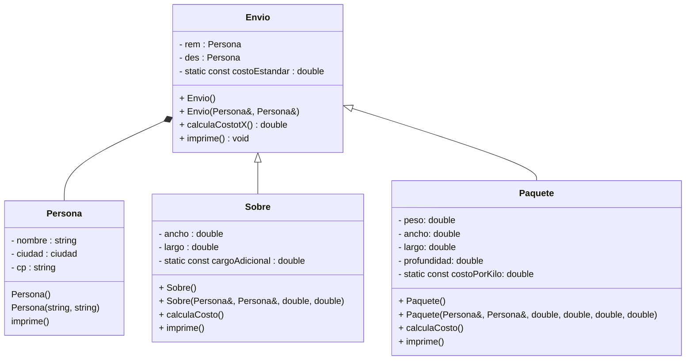

# Ejercicio-Autograding para C++ usando Catch2

**Fuente:** *Learning Autograding with C/C++ and Catch2 - Prof. Igor Machado Coelho* 
https://medium.com/swlh/easy-c-autograding-on-github-classroom-with-catch2-106ad1107402

## Descripción del Problema

Resolver situaciones reales empleando los conceptos de herencia, modificadores de acceso, sobrecarga y sobreescritura de métodos.

## Ejecución

El programa debe ejecutarse correctamente, deberás probar la creación de distintos objetos y usar sus métodos para comprobar que todo trabaja adecuadamente.

## Diagrama de Clases

## Objetivo

- Busca que el código pase correctamente todas las pruebas
   * Solamente cambia los archivos permitidos para lograr este objetivo (abajo se indican las reglas específicas)
   
- Las GitHub Actions deberán presentar una palomita en verde si se han satisfecho todas las pruebas, y una cruz roja cuando alguna (o todas) las pruebas han fallado.
   * **Recomendación:** Puedes dar clic en la cruz roja para verificar cual de las pruebas ha fallado (o si el código no ha compilado correctamente).
   * **Recomendación:** En caso de que el Autograding no muestre pruebas o no funcione, contacta a tu profesor

## Instrucciones

Deberás modificar los archivos `Persona.cpp` `Envio.cpp` `Paquete.cpp` `Sobre.cpp` de aacuerdo a las siguientes instrucciones:
- Una jerarquía de herencia para representar los diferentes tipos de paquetes. Tendremos la clase Envio como clase base de la jerarquía, luego incluye las clases Sobre y Paquete derivadas de Envio.

- Antes, para manejar el remitente y destinatario deberás construir una clase Persona que contenga los datos: nombre, ciudad y código postal. En el constructor por default inicia los 3 strings en "-". Incluye un método imprime que despliegue los datos en el siguiente formato:
´´´Nombre: nombre completo
Dirección: Ciudad CodigoPostal

Observa que hay un espacio después de los dos puntos y entre los datos. 
Respeta también que el nombre va en un renglón y la dirección en otro.

Ejemplo:
Nombre: Patricia Rosas
Dirección: Tlajomulco 45645´´´

- La clase base **Envio** debe incluir datos del remitente y el destinatario del envío . El constructor de la clase **Envio** debe iniciar estos valores en los datos miembros. El costo estándar será una constante de clase, es un valor double.

- La clase **Envio** debe proporcionar una función miembro **calculaCosto** que devuelve un valor double indicando el costo asociado con el envío del paquete, que en esta clase corresponde directamente al costo estándar.

- La Clase Derivada **Paquete** debe heredar la funcionalidad de la clase base **Envio**, pero también debe incluir datos miembros que representan peso, ancho, largo y profundidad. El costo por kilogramo (tipo double) será una constante estática de clase.

- El constructor con parámetros de la clase **Paquete** debe recibir estos valores para iniciar los datos miembro. Asegúrate de que el peso, ancho, largo, profundidad contengan valores positivos, si no, se les asignará un 0. En el constructor por default inícialos a 0. 

- La función **calculaCosto** de Paquete debe redefinirse para determinar el costo multiplicando el peso por el costo por kilogramo y sumarlo al costo estándar por envío.

- - La función **imprime** de Paquete deberá imprimir los datos base del envio y los datos del paquete (datos de sus medidas, peso y costo)

- La clase **Sobre** debe heredar directamente de la clase **Envio**, debe contar con los datos de largo y ancho del sobre.  Si las dimensiones del sobre exceden de 25cm en largo y en 30 en ancho, se agregue un cargo adicional (éste dato será una constante estática de clase). Largo, ancho y cargo adicional son valores double.

- La función **calculaCosto** de Sobre deberá entonces cobrar cargo adicional si se exceden las dimensiones como se comentó anteriormente, si no, simplemente tendrá el costo estándar.

- La función **imprime** de Sobre deberá imprimir los datos base del envio y los datos del sobre (datos de sus medidas y costo)

Explicación de los otros archivos:

- Archivo `test/tests.cpp` tiene las pruebas de esta actividad (NO LO CAMBIES!)
- Archivo `test/catch.hpp` tiene la biblioteca de pruebas  CATCH2 (NO LA CAMBIES!)
- Archivo `makefile` tienes los comandos para ejecutar la actividad (NO LO CAMBIES!)
- Archivo  `./build/appTests` se generará después de compilar (para **pruebas locales**, solo ejecútalo)

## Comandos para pruebas locales, ejecución y depuración

- Comando para construir y ejecutar pruebas: `make` o `make test`
    * Si el ejecutable ya está construido, sólo teclea : `./build/appTests`

- Comando para construir y ejecutar la aplicación: `make run` 
    * Si el ejecutable ya está construido, sólo teclea : `./build/exercise`

- Comando para depurar: `make debug`
    * Para conocer los comandos de depuración consulta:
     https://u.osu.edu/cstutorials/2018/09/28/how-to-debug-c-program-using-gdb-in-6-simple-steps/
     
- Comando para depurar con `vsCode` en `GitPod`: `make debugvs` 
    * Utilizar el depurador de la IDE.     

## Notas

- El código será evaluado solamente si compila.
   * La razón de esto es, si no compila no es posible generar el ejecutable y realizar las pruebas.

- Algunos casos de prueba podrían recibir calificación individual, otros podrían recibir calificación y si pasan todos juntos (o todas las pruebas en conjunto).

- La calificación final se otorgará de manera automática en cada *commit*, y se evaluará solamente hasta la fecha limite de la actividad.

Para dudas adicionales, consulta a tu profesor.

## License

MIT License 2020
